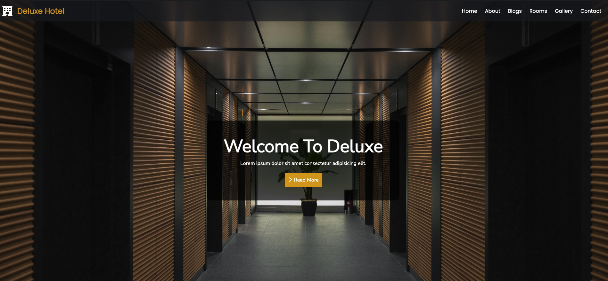
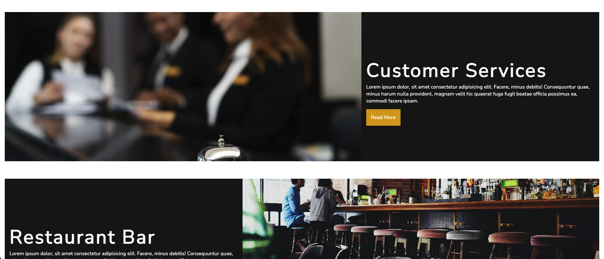
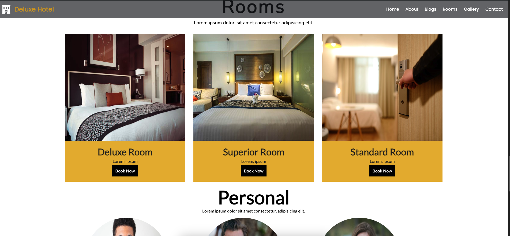
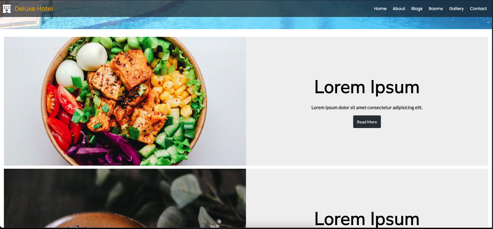

# Deluxe Hotel

A modern and responsive website for a luxury hotel, showcasing various room options, amenities, and booking functionalities. The project demonstrates advanced front-end development techniques using HTML, CSS, and JavaScript.

## Table of Contents
- [Demo](#demo)
- [Features](#features)
- [Technologies Used](#technologies-used)
- [Installation](#installation)
- [Usage](#usage)
- [Screenshot](#screenshot)
- [License](#license)
- [Contact](#contact)

## Demo

Check out the live demo: [Deluxe Hotel Demo](#) *(Replace `#` with the actual link if available)*

## Features

- Beautifully designed UI to showcase hotel rooms and amenities.
- Responsive layout adaptable to various screen sizes.
- JavaScript functionality for interactive elements like the booking form and image sliders.
- Dynamic content loading for a seamless user experience.

## Technologies Used

- **HTML5**: For structuring the website content.
- **CSS3**: For styling, layout, and responsive design.
- **JavaScript**: For adding interactivity and dynamic content manipulation.

## Installation

1. Clone the repository:

    ```bash
    git clone https://github.com/bkrcokan13/Deluxe-Hotel.git
    cd Deluxe-Hotel
    ```

2. Open `index.html` in your browser. (You can use extensions like **Live Server** for Visual Studio Code to launch a local development server for easier testing and development.)

## Usage

1. Open the `index.html` file in your browser to view the Deluxe Hotel website.
2. Browse through different sections like rooms, amenities, and the booking form.
3. The website layout and content will adjust based on screen size, ensuring a great experience on both desktop and mobile devices.

## Screenshot

Here is a screenshot of the Deluxe Hotel website:






## License

This project is licensed under the MIT License - see the [LICENSE](LICENSE) file for details.

## Contact

Created by [Okan Bakırcı](https://github.com/bkrcokan13) - feel free to contact me!
